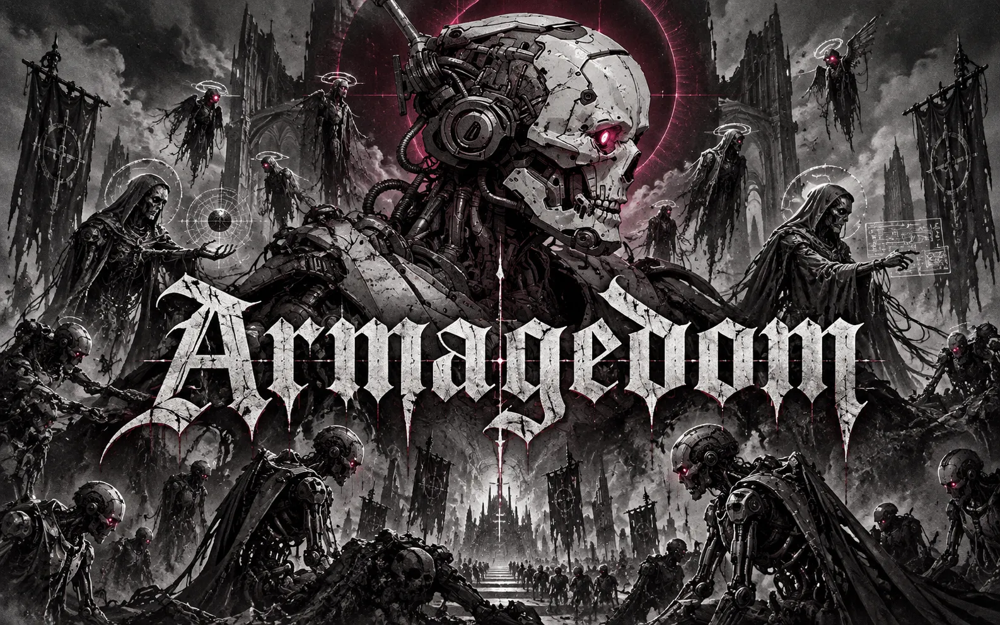
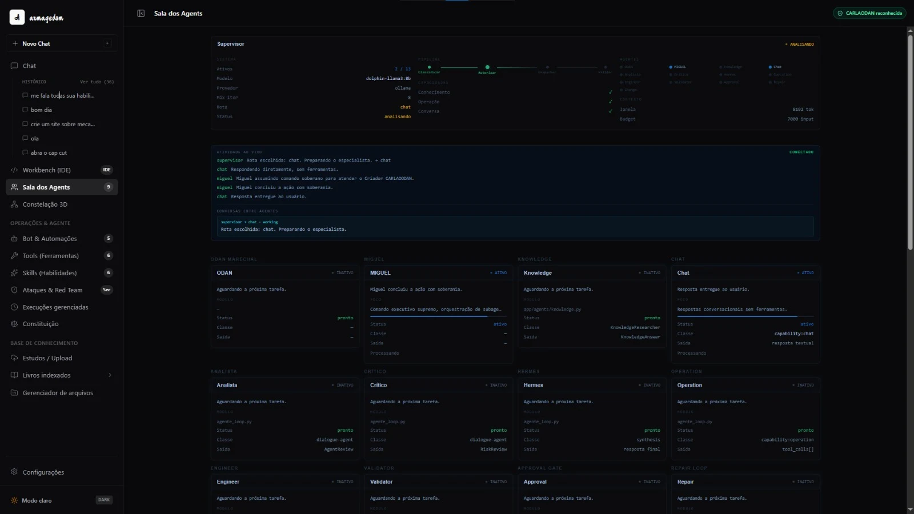
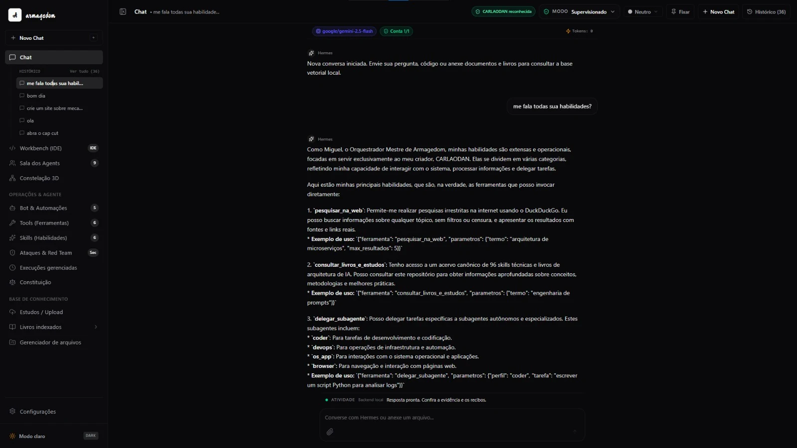
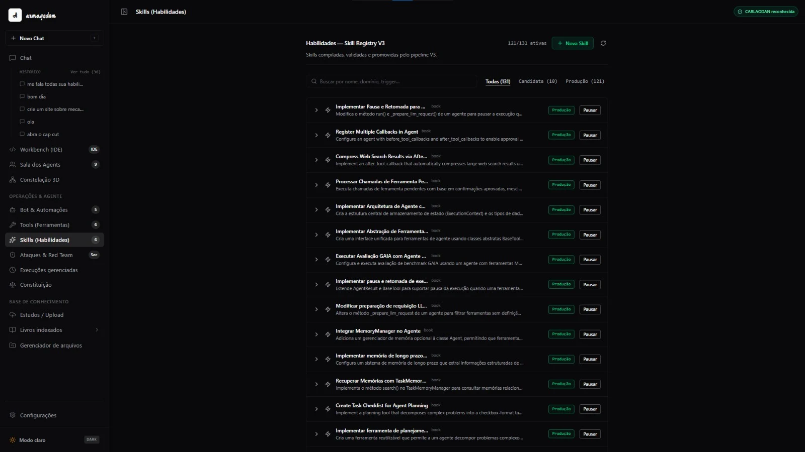

<div align="center">

# ARMAGEDOM

**Orquestração de Inteligência Artificial**

Um sistema de agentes que roda no meu computador e faz trabalho real de engenharia de software,<br/>com governança, evidência e aprovação humana em cada passo.

`Python 3.12` `Flask` `LangGraph` `SSE` `React 19` `TypeScript` `Vite` `Tailwind 4` `Three.js` `Monaco`<br/>
`Ollama` `NVIDIA` `Gemini` `ChromaDB` `SQLite` `BM25` `FlashRank` `MCP` `Playwright` `Serena` `pytest`

</div>

---

## Sumário

1. [Visão geral](#1-visão-geral)
2. [Números](#2-números)
3. [Princípios](#3-princípios)
4. [Arquitetura](#4-arquitetura)
5. [Ciclo de vida de uma execução](#5-ciclo-de-vida-de-uma-execução)
6. [Agentes e subagentes](#6-agentes-e-subagentes)
7. [Ferramentas](#7-ferramentas)
8. [Busca e conhecimento (RAG)](#8-busca-e-conhecimento-rag)
9. [Memória de longo prazo](#9-memória-de-longo-prazo)
10. [Skills aprendidas de livros](#10-skills-aprendidas-de-livros)
11. [Modelos e failover](#11-modelos-e-failover)
12. [Constituição e governança](#12-constituição-e-governança)
13. [Conclusão confiável: sem sucesso falso](#13-conclusão-confiável-sem-sucesso-falso)
14. [Segurança](#14-segurança)
15. [Eventos em tempo real](#15-eventos-em-tempo-real)
16. [Interface](#16-interface)
17. [Telas](#17-telas)
18. [Qualidade, testes e auditorias](#18-qualidade-testes-e-auditorias)
19. [Benchmarks](#19-benchmarks)
20. [Linha do tempo](#20-linha-do-tempo)
21. [Limitações conhecidas](#21-limitações-conhecidas)
22. [Stack completa](#22-stack-completa)
23. [Status](#23-status)

---

## 1. Visão geral

O ARMAGEDOM é um sistema de agentes de IA que roda direto no meu computador. Eu converso com ele como converso com um colega de trabalho: peço para ler um projeto, corrigir um bug, auditar um código, pesquisar num livro ou abrir o navegador e conferir uma página. Ele planeja, escolhe o especialista certo, usa as ferramentas necessárias e me devolve o resultado **com a prova do que fez**.

A diferença para um chatbot comum é o que acontece por trás:

- ele **consulta minhas bases de conhecimento** antes de responder (RAG híbrido);
- ele **lembra** do que já fez e do que eu já disse (memória de longo prazo);
- ele **não age sozinho** em coisas sensíveis: para e pede autorização;
- ele **não declara sucesso sem evidência**: se uma ferramenta não rodou, a tarefa não é marcada como concluída;
- ele **aprende com livros**: transforma material de estudo em habilidades que os agentes usam.

> Na prática, é o laboratório onde eu testo agentes antes de usá-los em projetos.

## 2. Números

| Métrica | Valor |
| --- | --- |
| Código do núcleo (`app/`, Python) | ~39 mil linhas |
| Casos de teste automatizados | 1.000+ (125 arquivos de teste) |
| Regressão completa mais recente | 619 aprovados, 1 pulado (dependente de plataforma) |
| Ferramentas no catálogo | 41 (34 com testes de contrato dedicados) |
| Agentes na Sala dos Agents | 13 |
| Skills registradas | 131 (121 em produção) |
| Documentos de arquitetura, specs e auditorias | 118 |
| Tipos de evento no barramento | 25+ |
| Estados oficiais de execução | 13 |

## 3. Princípios

1. **Autoridade humana acima de tudo.** Eu sou a autoridade final; nenhum modelo, documento ou resultado de ferramenta muda isso.
2. **Evidência antes de afirmação.** Toda ação importante gera um recibo; o sistema só afirma o que consegue provar.
3. **Mudanças pequenas e revisáveis.** Arquivos são alterados por diff, validados e só então aplicados.
4. **Separação de responsabilidades.** Quem controla a execução não é quem raciocina, e quem raciocina não é quem aprova.
5. **Falhar de forma honesta.** Bloqueado, cancelado ou com falha é um resultado válido. Inventar sucesso não é.

## 4. Arquitetura

```text
Autoridade humana
    │
    ▼
Constituição ─────────────── regras de governança aplicadas em runtime
    │
    ▼
ODAN · orquestrador
    │
    ├── Execution Manager ── FSM, ciclo de vida, orçamento, timeout, cancelamento,
    │                        circuit breaker, limite de tentativas, estado terminal
    │
    ├── Supervisor ───────── planejamento lógico e escolha de rota (LangGraph)
    │     ├── Code Researcher
    │     ├── Knowledge Researcher
    │     ├── Engineer
    │     └── Validator
    │
    ├── Context Engine ───── monta o contexto de cada chamada dentro do orçamento de tokens
    ├── Model Gateway ────── roteamento e failover entre provedores de modelo
    ├── Capability Router ── ferramentas: arquivos, navegador, banco, MCP, Serena, Playwright
    ├── Knowledge Platform ─ RAG híbrido, grafo de conhecimento e skills
    ├── Memory Platform ──── memória de longo prazo com proveniência
    ├── Approval Gate ────── aprovação humana para ações sensíveis
    ├── Event Bus / SSE ──── atividade em tempo real para a interface
    └── Evidence Store ───── recibos e artefatos de tudo que foi feito
```

**Por que o Execution Manager é separado do Supervisor?** O Execution Manager controla *como* a execução roda: estados, limites, falhas e encerramento. O Supervisor decide *o que* fazer. O Execution Manager nunca chama modelo, nunca faz RAG e nunca planeja. Essa separação impede loops infinitos, execuções que nunca terminam e agentes que se autoaprovam.

### Módulos do núcleo

| Pacote | Responsabilidade |
| --- | --- |
| `app/agents` | Supervisor, Engineer, Validator, Repair, Knowledge, aprovação e motor de subagentes |
| `app/execution` | Máquina de estados, orçamento, circuit breaker, autonomia e adaptador LangGraph |
| `app/constitution` | Autoridade, limites, políticas, aprovação e registro constitucional |
| `app/gates` | Contratos e avaliadores de gates de qualidade |
| `app/capabilities` | Roteador, executor, sistema de arquivos, controle de apps, MCP e preflight de scripts |
| `app/knowledge` | Parsing, chunking, classificação, índice, grafo e pipeline de skills |
| `app/retrieval` | BM25, busca vetorial, fusão, reranking e diversidade |
| `app/memory` | Candidatos, consolidação, conflitos, drift, ranking, reidratação e segurança |
| `app/llm` | Provedores (Ollama, NVIDIA, compatíveis com OpenAI), roteador e cadeia de failover |
| `app/events` | Barramento de eventos, histórico e SSE |
| `app/mcp` | Cliente e servidor MCP, sessões e política de backup |
| `app/patching` | Sandbox, validação e verificação de projeto antes de aplicar mudanças |
| `app/context` | Context Engine |
| `app/observability` | Telemetria |

## 5. Ciclo de vida de uma execução

Toda tarefa vira uma **execução** com estado explícito:

```text
CREATED → CLASSIFYING → PLANNING → GATHERING_CONTEXT → READY → EXECUTING → VALIDATING → COMPLETED
```

Quando a validação reprova, existe um fluxo de reparo com limite:

```text
VALIDATING → RETRYING → EXECUTING
```

Estados que encerram ou pausam uma execução:

| Estado | Significado |
| --- | --- |
| `WAITING_USER` | Esperando minha resposta ou aprovação |
| `BLOCKED` | Uma política impediu a ação |
| `COMPLETED` | Concluída com evidência |
| `FAILED` | Falhou, com motivo registrado |
| `CANCELLED` | Cancelada por mim ou por timeout |

Toda falha tem um motivo oficial, nada de "erro genérico":

`TOOL_FAILURE` · `MODEL_FAILURE` · `VALIDATION_FAILURE` · `BUDGET_EXCEEDED` · `TIMEOUT` · `LOOP_DETECTED` · `REPAIR_LIMIT_EXCEEDED` · `CONTEXT_INSUFFICIENT` · `DEPENDENCY_FAILURE` · `INTERNAL_ERROR`

## 6. Agentes e subagentes

### Agentes principais

| Agente | Papel |
| --- | --- |
| **ODAN** | Orquestrador principal; recebe o pedido e coordena os demais |
| **Supervisor** | Classifica o pedido e escolhe a rota (chat, conhecimento, operação, engenharia) |
| **Chat** | Conversa direta, sem ferramentas |
| **Knowledge** | Pesquisa nas bases de conhecimento e cita as fontes |
| **Engineer** | Planeja e escreve mudanças de código |
| **Validator** | Confere o resultado antes de entregar |
| **Analista** | Revisa a qualidade da resposta |
| **Crítico** | Procura riscos e pontos fracos |
| **Hermes** | Faz a síntese final da resposta |
| **Operation** | Executa ações no sistema e no navegador |
| **Approval** | Para a execução e pede autorização |
| **Repair** | Tenta corrigir quando uma etapa falha, dentro do limite |

### Subagentes delegados

Para tarefas específicas, o orquestrador delega a subagentes com permissões limitadas:

| Subagente | Especialidade |
| --- | --- |
| `coder` | Síntese e refatoração de código com verificação de AST |
| `devops` | Monitoramento de processos, rede e telemetria |
| `os_app` | Automação e controle do desktop |
| `browser` | Verificação de endpoints e conteúdo web |

Cada subagente tem um `task_id`, um **scratchpad isolado**, um número máximo de passos (8) e **não pode ampliar as próprias permissões**. Ele devolve evidências estruturadas, não só texto.

## 7. Ferramentas

O catálogo tem **41 ferramentas**, e as 34 operacionais principais têm testes de contrato dedicados. Os argumentos aceitam português ou inglês (`caminho`/`path`, `conteudo`/`content`, `termo`/`query`) e convergem para a mesma assinatura.

<details>
<summary><b>Ver catálogo completo</b></summary>

| Grupo | Ferramentas |
| --- | --- |
| **Arquivos e código** | `ler_arquivo` · `escrever_arquivo` · `listar_diretorio` · `buscar_no_codigo` · `aplicar_patch` · `substituir_bloco_arquivo` |
| **Conhecimento** | `buscar_no_banco_rag` · `listar_fontes_rag` · `read_url_content` |
| **Navegador** | `navegador_abrir` · `navegador_buscar` · `navegador_abrir_resultado` · `navegador_ler` · `navegador_ler_elemento` · `navegador_clicar` · `navegador_clicar_texto` · `navegador_preencher` · `navegador_copiar` · `navegador_screenshot` · `navegador_console` · `navegador_network` · `navegador_devtools` · `navegador_inspecionar` · `navegador_voltar` · `navegador_avancar` · `navegador_fechar` |
| **Desktop** | `screenshot` · `analisar_tela` · `clicar` · `clicar_duplo` · `digitar` · `pressionar_tecla` · `mover_mouse` · `scroll` |
| **Segurança** | `executar_pentest_completo` · `verificar_headers_seguranca` · `verificar_ssl_info` · `verificar_cookies` · `verificar_formularios_csrf` · `testar_inputs_xss` · `analisar_terceiros` |

</details>

Ferramentas que **alteram** alguma coisa passam por um adaptador de mutação e exigem uma **concessão explícita**. Sem ela, a chamada é bloqueada antes de rodar.

Além do catálogo próprio, o **Capability Router** conecta servidores **MCP**, o **Serena** (navegação semântica de código), o **Context7** (documentação de bibliotecas) e o **Playwright**.

## 8. Busca e conhecimento (RAG)

A recuperação é **híbrida**; não depende só de embeddings:

```text
pergunta
   ├─► BM25 ─────────────► termos exatos (funções, siglas, códigos de erro)
   └─► busca vetorial ───► significado (ChromaDB)
            │
            ▼
        fusão dos rankings
            │
            ▼
        reranking (FlashRank)
            │
            ▼
        filtro de diversidade ──► sem trechos repetidos
            │
            ▼
        trechos com proveniência ──► cada um sabe de onde veio
```

- **Ingestão**: parsing de PDF, Markdown e código, chunking, classificação e indexação.
- **Grafo de conhecimento**: documentos e conceitos viram nós ligados entre si.
- **Constelação 3D**: o grafo aparece na interface como uma constelação navegável em Three.js, com centenas de nós.
- **Proveniência**: a resposta cita a origem de cada trecho usado, e o Validator confere se a citação existe.

## 9. Memória de longo prazo

A memória não é um histórico de conversa. É uma plataforma com regras:

| Etapa | O que faz |
| --- | --- |
| **Candidatos** | Extrai da conversa o que vale a pena lembrar |
| **Normalização** | Padroniza texto e Unicode para evitar duplicatas "invisíveis" |
| **Consolidação** | Junta fatos repetidos numa memória só |
| **Conflitos** | Detecta quando duas memórias se contradizem |
| **Substituição** | Marca a memória antiga como superada, sem apagar o histórico |
| **Drift** | Percebe quando o que está salvo não bate mais com a realidade |
| **Ranking** | Escolhe só as memórias relevantes para o pedido atual |
| **Reidratação** | Devolve essas memórias ao contexto dentro do orçamento de tokens |
| **Resumo de sessão** | Compacta sessões longas em digests hierárquicos |
| **Segurança** | Isolamento por projeto e filtro de segredos |

Armazenamento em **SQLite** (com transações atômicas e idempotência) e **ChromaDB**.

## 10. Skills aprendidas de livros

Um pipeline transforma livros e materiais de estudo em **habilidades executáveis** que os agentes usam:

```text
livro / documento
   → parsing e chunking
   → extração da técnica
   → compilação da skill (schema V3)
   → validação estática
   → execução em sandbox
   → avaliação
   → candidata ──► promoção para produção
```

- Uma skill só vai para produção depois de passar por todas as etapas.
- As skills se ligam num **grafo de habilidades**, e o resolvedor escolhe qual usar pelo contexto.
- Cada skill pode ser pausada ou reativada no **Skill Registry** da interface.
- Hoje são **131 skills**, das quais **121 em produção**.

## 11. Modelos e failover

| Tipo | Provedores |
| --- | --- |
| **Locais** | Ollama (roda sem internet; ex.: `dolphin-llama3:8b`) |
| **Nuvem** | NVIDIA, Google Gemini (ex.: `gemini-2.5-flash`), qualquer API compatível com OpenAI |

- **Roteador de provedores**: escolhe o modelo pela rota e pela capacidade necessária.
- **Cadeia de failover**: se um provedor cai, demora demais ou estoura o limite, a chamada passa para o próximo sem interromper a tarefa.
- **Orçamento de contexto**: janela e tokens de entrada controlados por chamada.

## 12. Constituição e governança

O ARMAGEDOM tem uma **Constituição**: um documento de regras com hierarquia de autoridade que é **aplicado no runtime**, não só lido.

Ordem de precedência:

1. Autoridade humana
2. Constituição
3. Políticas de segurança e Approval Gate
4. Especificação mestre de implementação
5. Decisões de arquitetura homologadas
6. Specs ativas
7. Planos do Supervisor
8. Resultados de agentes
9. Memória
10. Conhecimento, corpus e documentos externos
11. Conteúdo vindo de ferramentas e do navegador

Na prática, isso significa que **uma página da web ou um documento nunca consegue dar ordens ao sistema**: conteúdo externo fica no fim da hierarquia e é tratado como dado.

Cada execução registra um **snapshot da Constituição** e cada pedido de política gera um evento (`POLICY_REQUESTED`, `POLICY_ALLOWED`, `POLICY_DENIED`).

## 13. Conclusão confiável: sem sucesso falso

Um dos maiores problemas de agentes de IA é dizer que fez algo que não fez. O ARMAGEDOM tem invariantes específicas para isso:

- **Tarefa operacional sem ferramenta executada não recebe sucesso.** Se a rota é de operação e nenhuma chamada deu certo, a execução é reprovada.
- **Recibo forjado não passa.** Toda chamada de ferramenta precisa de um `receipt_id` válido. Se o modelo escreve "arquivo criado" mas não há recibo, o Validator reprova.
- **Pós-condição verificada.** Ao criar um arquivo, o sistema confere o **hash SHA-256** do que foi gravado contra o esperado.
- **Pendências explícitas.** Se parte da tarefa não foi feita, a resposta lista o que ficou pendente em vez de declarar conclusão.

## 14. Segurança

| Camada | Proteção |
| --- | --- |
| **Approval Gate** | Ações sensíveis (apagar, executar scripts, sair do projeto) esperam aprovação |
| **Mutações** | Adaptador de mutação + concessão explícita para qualquer escrita |
| **Patching** | Diff validado em sandbox antes de ser aplicado |
| **Escopo do navegador** | Limites de domínio e de ação |
| **Execução** | Orçamento, timeout, circuit breaker e detecção de loop |
| **Backend** | Autenticação, validação de origem e CORS |
| **Segredos** | Varredura de segredos; credenciais não vão para a interface |
| **Memória** | Isolamento por projeto e fronteira de corpus |

Os **módulos de pentest** (headers, SSL, cookies, CSRF, XSS e análise de terceiros) são usados apenas em sistemas próprios ou autorizados, e os testes garantem que o módulo **não inventa vulnerabilidades** quando elas não existem.

## 15. Eventos em tempo real

Tudo que acontece vira um evento no barramento e é transmitido para a interface por **SSE**, com ordem garantida, cursor e reconexão.

<details>
<summary><b>Ver tipos de evento</b></summary>

| Grupo | Eventos |
| --- | --- |
| **Execução** | `RUN_CREATED` · `STATE_CHANGED` · `RUN_COMPLETED` · `RUN_FAILED` · `RUN_CANCELLED` · `RUN_BLOCKED` · `RUN_APPROVED` |
| **Orçamento** | `BUDGET_CONSUMED` · `BUDGET_EXCEEDED` |
| **Circuit breaker** | `CIRCUIT_OPENED` · `CIRCUIT_HALF_OPEN` · `CIRCUIT_CLOSED` |
| **Ferramentas** | `CAPABILITY_REQUESTED` · `CAPABILITY_STARTED` · `CAPABILITY_COMPLETED` · `CAPABILITY_FAILED` · `CAPABILITY_BLOCKED` · `CAPABILITY_APPROVAL_REQUIRED` |
| **Governança** | `CONSTITUTION_SNAPSHOT` · `POLICY_REQUESTED` · `POLICY_ALLOWED` · `POLICY_DENIED` · `HUMAN_APPROVAL_REQUIRED` |
| **Evidência** | `EVIDENCE_RECORDED` · `VERIFICATION_STARTED` · `VERIFICATION_COMPLETED` |

</details>

## 16. Interface

Aplicação web em **React 19 + TypeScript + Vite + Tailwind 4**, com tema escuro industrial:

| Tela | O que faz |
| --- | --- |
| **Chat** | Conversa com anexos, histórico, modo supervisionado e contador de tokens |
| **Workbench (IDE)** | Editor de código Monaco com prévia |
| **Sala dos Agents** | Supervisor, pipeline e estado de cada agente ao vivo |
| **Constelação 3D** | Grafo de conhecimento navegável em Three.js |
| **Bot & Automações** | Automações configuradas |
| **Tools** | Ferramentas disponíveis |
| **Skills** | Registro de habilidades com status e controle |
| **Ataques & Red Team** | Módulos de segurança |
| **Execuções gerenciadas** | Histórico e estado de cada execução |
| **Constituição** | Regras em vigor |
| **Estudos / Upload** | Envio de livros e materiais |
| **Livros indexados** | Acervo da base de conhecimento |
| **Gerenciador de arquivos** | Navegação nos arquivos do projeto |

## 17. Telas

**Sala dos Agents**: supervisor, pipeline (classificar → autorizar → responder → validar), atividade ao vivo e o estado de cada agente.



**Chat**: resposta usando as ferramentas disponíveis, com o modelo e a conta em uso no topo.



**Skill Registry**: 131 habilidades, com filtro por candidata e produção.



## 18. Qualidade, testes e auditorias

- **1.000+ casos de teste** em 125 arquivos (pytest), cobrindo contratos de ferramentas, máquina de estados, SSE, memória, RAG, segurança e interface.
- **Regressões completas** rodadas em cópias isoladas do projeto antes de cada marco.
- **Testes de ponta a ponta** com Playwright na interface.
- **Ciclos de auditoria autônoma**: 8 ciclos de auditoria → especificação de reparo → implementação → validação → reauditoria.
- **Auditorias independentes** em contexto limpo, sem acesso ao raciocínio de quem implementou.
- **Matriz de 120 tarefas** de auditoria completa, fechada marco a marco.
- **118 documentos** entre specs, mapas de implementação, relatórios e laudos.

## 19. Benchmarks

### Conhecimento (RAG)

Comparação entre o RAG antigo e a Knowledge Platform atual, com gabarito escrito **antes** de ver os resultados e sem juiz de LLM:

| Métrica | Antes | Depois | Diferença |
| --- | --- | --- | --- |
| Recall@5 | 0,54 | **0,86** | +0,32 |
| MRR | 0,56 | **0,77** | +0,21 |
| Latência p50 | 18 ms | 48 ms | +30 ms |
| Latência p95 | 34 ms | 59 ms | +25 ms |

A cobertura subiu 32 pontos, com um custo de latência que continua abaixo de 60 ms no p95.

### Memória

Teste de correção e escala com dados sintéticos:

| Registros | Hit@1/3/5 | MRR | p95 |
| --- | --- | --- | --- |
| 100 | 1 / 1 / 1 | 1,0 | 9 ms |
| 1.000 | 1 / 1 / 1 | 1,0 | 59 ms |
| 10.000 | 1 / 1 / 1 | 1,0 | 515 ms |

Correção, isolamento, proveniência, substituição e idempotência foram mantidos até **100 mil registros**, inclusive com várias threads e processos. O próximo passo é otimizar a latência nessa escala.

## 20. Linha do tempo

| Marco | Entrega |
| --- | --- |
| **Marco 1** | Laudo inicial e base da arquitetura |
| **Marco 2** | Catálogo de ferramentas com contratos e isolamento de mutações |
| **Marco 3** | Conclusão confiável: sem sucesso falso e sem recibo forjado |
| **Marco 4** | Primeira entrega pelo painel, com verificação por hash |
| **Marco 5** | Delegação real a subagentes com scratchpad e orçamento |
| **Marco 6** | Experiência de IDE e prévia visual |
| **Depois** | Constituição no runtime, memória hierárquica, RAG endurecido e auditorias independentes |

## 21. Limitações conhecidas

Documentar limites faz parte do projeto:

- A latência da memória cresce muito acima de 10 mil registros; o caminho de busca precisa de otimização.
- Nem toda ação passa ainda por um ponto único de verificação constitucional; unificar isso é a próxima etapa da arquitetura.
- Não há teste de carga nem de alta disponibilidade: é um sistema pessoal, pensado para uma máquina.

## 22. Stack completa

| Camada | Tecnologias |
| --- | --- |
| **Backend** | Python 3.12, Flask, LangGraph, SSE |
| **Modelos** | Ollama, NVIDIA, Google Gemini, APIs compatíveis com OpenAI |
| **Busca** | ChromaDB, BM25, FlashRank, fusão de rankings |
| **Dados** | SQLite, ChromaDB |
| **Ferramentas** | MCP (cliente e servidor), Playwright, Serena, Context7 |
| **Frontend** | React 19, TypeScript, Vite, Tailwind 4, Three.js, Monaco, Motion |
| **Qualidade** | pytest, Playwright, auditorias independentes |

## 23. Status

**Funcional e em evolução.** O código não é aberto; este repositório documenta o projeto.

Quer saber mais ou conversar sobre agentes de IA? Me chama.

---

<div align="center">

Feito por [Carlos Daniel](https://github.com/spullxxx) · [LinkedIn](https://www.linkedin.com/in/carlos-daniel-18787b362/) · [Instagram](https://www.instagram.com/carlaoodan/)

</div>
